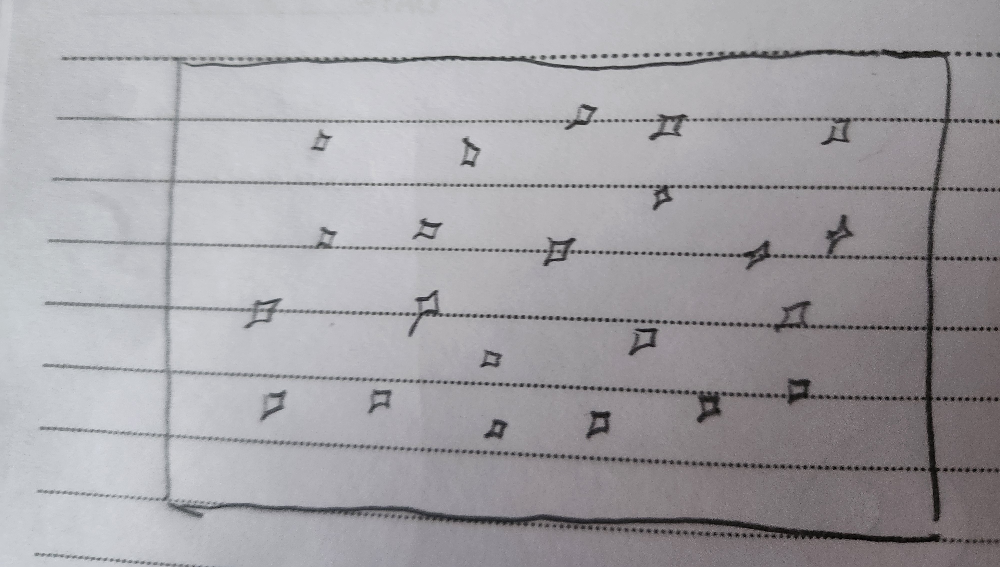
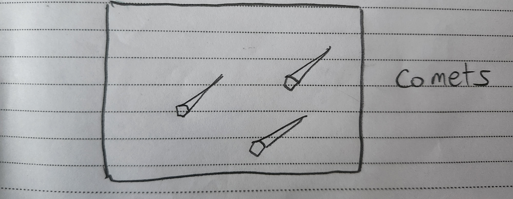
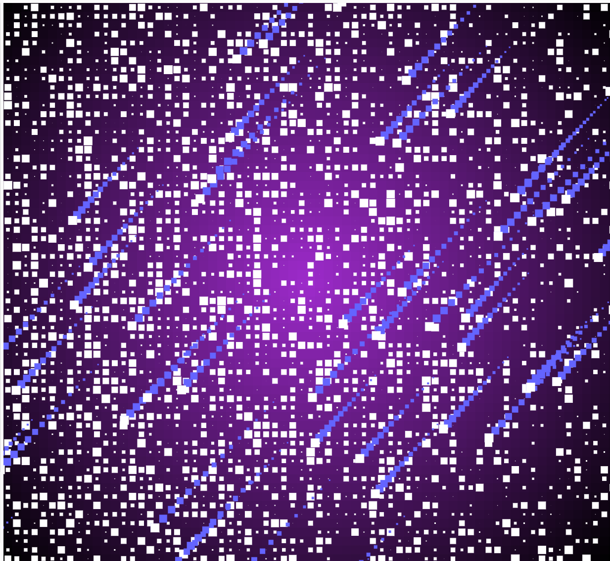
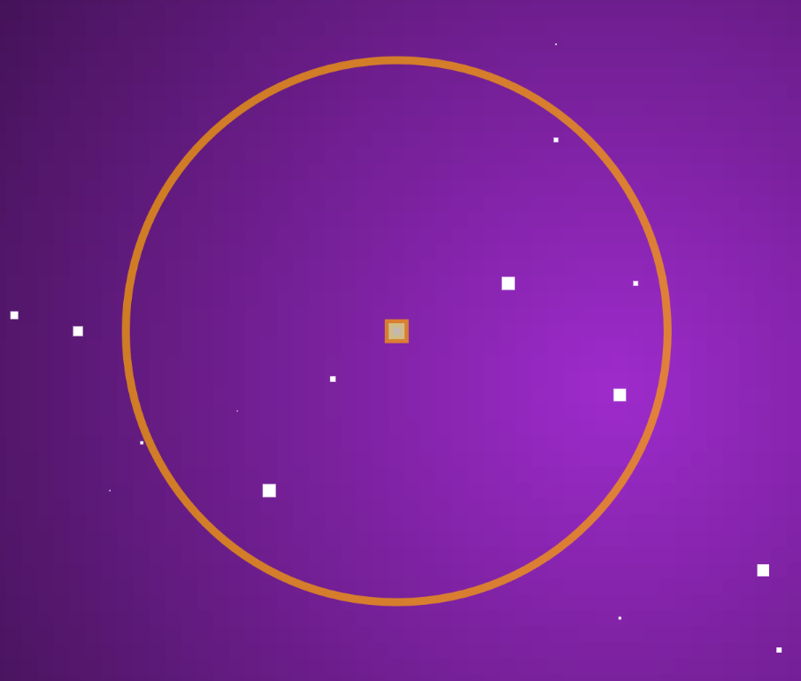

# Project Details Gabriel

## Space background that can be used as a live wallpaper

[image]

Here, I am working on a background with stars and outer space scenery that could be used a  live wallpaper for windows devices.

Basically it has a pixellated look. There is a layer showing the main space which is light purple at center and slowly changes with a gradient to black at the outer parts

There are stars that flash periodically with time

There are comets that appears and move on screen and repeat.

[image](./content/Project_GENCG/Full%20concept.jpg)

First I decided to organaise the project into layers. There were 3 main ones

1. A layer with the background space. To achieve this I used a gradient that was bright purple at the center of the canvas and dark black at the edges of the canvas. I used pixels to give it a pixellated feel and view as I really like those kinds of visuals

[image](./content/Project_GENCG/SpaceBackground.jpg)

2. A layer which has stars that seem to flash. I did this by making them larger and smaller over an interval of time. They are randomly places all over the canvas

3. A layer which has comets which move from the top right of the screen to the bottom left of the screen to really bring the imagery to life.

<!-- 
<iframe src="./Project_GENCG/space3(comets).jpg" width="100%" height="450" frameborder="no"></iframe>
 -->

Here is a concept art on pinterest I took inspiration from
.jpg)

Here is a look at iteration 1.

Here is a look at the project. I had a bug where if the screen was resized too many stars and comets would be generated which I fixed in the second iteration.

I felt that there was not enough stars on the screen so I reduced increase the ratio of stars to pixels(background).

I decided to add a explosion that simulated a supernova. I did this by having a circle that expanded outwards by changing radius. I had the colour of the circle fade as time passed. In addition, I decided to add a trail where the player moved their cursor to recreate the feeling of dust and light in space


<iframe src="https://editor.p5js.org/t2005gabriel/full/e41fTwBxB" width="2000" height="800"></iframe>


<iframe 
    src="https://editor.p5js.org/t2005gabriel/full/e41fTwBxB" 
    width="95%" 
    height="800px" 
    frameborder="0"  ></iframe>

